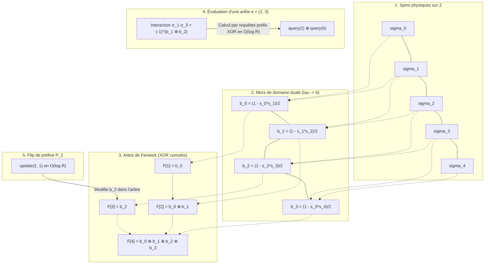

# Rapport : dynamique de Glauber géométrique sur $\mathbb{Z}$ avec arbre de Fenwick

## 1. Objectif

On considère un graphe signé pondéré dont les sommets sont des reads ordonnés le long d'un chromosome :

$$
0, 1, \dots, R-1
$$

Chaque read porte un spin caché :

$$
\sigma_{i} \in \lbrace -1, +1\rbrace
$$

Les poids d'arêtes encodent des contraintes ferromagnétiques ou antiferromagnétiques :
*   Si $W_{ij} > 0$, l'arête préfère $\sigma_{i} = \sigma_{j}$ ;
*   Si $W_{ij} < 0$, l'arête préfère $\sigma_{i} \neq \sigma_{j}$ ;
*   L'intensité de la contrainte est $|W_{ij}|$.

L'objectif est de construire une dynamique MCMC de type **Glauber / Heat-Bath** adaptée à la géométrie unidimensionnelle, s'appuyant sur un **arbre de Fenwick** (Binary Indexed Tree) modulo 2 pour gérer efficacement l'ensemble des arêtes (toutes considérées comme longue portée).

---

## 2. Mesure cible

On écrit l'énergie sous la forme "arêtes non satisfaites" :

$$
U(\sigma) = \sum_{\lbrace i,j\rbrace: W_{ij}>0} |W_{ij}| \mathbf{1}_{\sigma_{i} \neq \sigma_{j}} + \sum_{\lbrace i,j\rbrace: W_{ij}<0} |W_{ij}| \mathbf{1}_{\sigma_{i} = \sigma_{j}}
$$

La postérieure cible, à température inverse $\beta$, est :

$$
\pi_{\beta}(\sigma \mid W) \propto \exp\bigl(-\beta U(\sigma)\bigr)
$$

Le cas $\beta=1$ correspond à la postérieure bayésienne non tempérée.

---

## 3. Variation d'énergie

Soit $A$ un ensemble de sommets que l'on flippe (renversement de spins) :

$$
\sigma_{i}'= \begin{cases} -\sigma_{i}, & i \in A \\\\ \sigma_{i}, & i \notin A \end{cases}
$$

Seules les arêtes coupées par $A$ changent de satisfaction. On note la coupe induite par $A$ :

$$
\delta(A) = \lbrace \lbrace i,j\rbrace\in E: |\lbrace i,j\rbrace\cap A| = 1\rbrace
$$

La variation d'énergie résultant du flip est alors :

$$
\Delta U(A) = U(\sigma')-U(\sigma) = \sum_{\lbrace i,j\rbrace\in \delta(A)} W_{ij}\sigma_{i}\sigma_{j}
$$

Pour évaluer un mouvement, il suffit de sommer les contributions signées $W_{ij}\sigma_{i}\sigma_{j}$ des arêtes traversées par la coupe $\delta(A)$ induite par ce mouvement.

---

## 4. Variables duales sur $\mathbb{Z}$

La géométrie sur $\mathbb{Z}$ suggère d'introduire les variables de murs de domaine :

$$
\tau_{t} = \sigma_{t}\sigma_{t+1}, \qquad t = 0, \dots, R-2
$$

Pour $i < j$, on reconstruit l'interaction de spin par le produit cumulé :

$$
\sigma_{i}\sigma_{j} = \prod_{t=i}^{j-1}\tau_{t}
$$

Un flip de préfixe $P_{q} = \lbrace 0, 1, \dots, q\rbrace$ ne modifie qu'un seul mur dans la représentation duale :

$$
\tau_{q} \mapsto -\tau_{q}
$$

Ainsi, dans les variables duales, les mouvements de préfixe sont parfaitement locaux. Dans les variables de spins d'origine, ils correspondent à des flips macroscopiques de blocs contigus le long du chromosome, ce qui permet de corriger efficacement les erreurs de phase (*switch errors*).

---

## 5. Définition des 4 mouvements de Glauber

Pour un read $r$, on définit les 4 mouvements candidats d'inversion :
1.  $A_{0} = \varnothing$ (mouvement nul, ne fait rien)
2.  $A_{1} = \lbrace r\rbrace = P_{r-1} \triangle P_{r}$ (flip singleton)
3.  $A_{2} = P_{r-1}$ (flip du préfixe s'arrêtant avant $r$)
4.  $A_{3} = P_{r}$ (flip du préfixe incluant $r$)

Aux bords du domaine et dans l'espace quotienté par le flip global :
*   $P_{-1}$ est le mouvement nul $\varnothing$ ;
*   $P_{R-1}$ est le flip global de tous les spins, donc il est identifié au mouvement nul $\varnothing$.

Dans les variables duales, en posant $e_{q}$ pour le flip du mur $q$ et $e_{-1}=e_{R-1}=0$, les mouvements sont :

$$
\mathcal{M}_{r} = \lbrace 0, e_{r-1}, e_{r}, e_{r-1}+e_{r}\rbrace.
$$

Cet ensemble est fermé par composition XOR. Il forme donc une classe locale de heat-bath exacte.

---

## 6. Noyau de transition : heat-bath local fermé

Pour un read $r$ choisi uniformément dans $\lbrace 0, \dots, R-1\rbrace$, on évalue les variations d'énergie $\Delta U(A)$ pour les mouvements distincts $A \in \mathcal{M}_{r}$.

On choisit un mouvement $A \in \mathcal{M}_{r}$ avec la probabilité de heat-bath :

$$
p(A) = \frac{\exp(-\beta \Delta U(A))}{\sum_{B \in \mathcal{M}_{r}} \exp(-\beta \Delta U(B))}
$$

*Note : Le mouvement nul $A=\varnothing$ ayant une variation d'énergie nulle $\Delta U(\varnothing) = 0$, son poids de Boltzmann au dénominateur vaut toujours $\exp(-\beta \cdot 0) = 1$.*

#### Réversibilité

Pour $r$ fixé, les 4 mouvements forment une classe fermée :

$$
\mathcal{C}_{r}(\sigma) = \lbrace \sigma \oplus A : A \in \mathcal{M}_{r}\rbrace.
$$

Si $\sigma' \in \mathcal{C}_{r}(\sigma)$, alors $\mathcal{C}_{r}(\sigma') = \mathcal{C}_{r}(\sigma)$. La normalisation locale est donc la même depuis tous les états de la classe :

$$
H_{r}(\sigma) = \sum_{\eta \in \mathcal{C}_{r}(\sigma)} \exp(-\beta U(\eta)).
$$

Le noyau conditionnel :

$$
q_{r}(\sigma,\sigma') = \frac{\exp(-\beta U(\sigma'))}{H_{r}(\sigma)} \mathbf{1}_{\sigma' \in \mathcal{C}_{r}(\sigma)}
$$

vérifie directement la balance détaillée :

$$
\pi_{\beta}(\sigma) q_{r}(\sigma,\sigma') = \pi_{\beta}(\sigma') q_{r}(\sigma',\sigma).
$$

Le mélange uniforme sur $r$ conserve cette réversibilité. Aucun filtre Metropolis-Hastings n'est nécessaire.

---

## 7. Arbres de Fenwick pour la Longue Portée

Puisque les reads et les arêtes s'étendent sur de longues distances (long reads), nous n'utilisons aucune distinction entre arêtes courtes et longues. L'ensemble des interactions du graphe est traité sous forme de **longue portée**. Nous n'allouons pas de tableau physique pour stocker les signes d'interaction $y_{e} = W_{e} \sigma_{i} \sigma_{j}$ en mémoire. À la place, nous maintenons l'état des spins duals $\tau_{t} \in \lbrace -1, +1\rbrace$ de manière paresseuse et dynamique grâce à un **arbre de Fenwick** (Binary Indexed Tree) modulo 2.

### 7.1 Principe de l'arbre modulo 2

Nous convertissons les variables de mur $\tau_{t} \in \lbrace -1, +1\rbrace$ en bits $b_{t} \in \lbrace 0, 1\rbrace$ via le codage :

$$
b_{t} = \frac{1 - \tau_{t}}{2} \quad \left(b_{t} = 0 \iff \tau_{t} = +1, \quad b_{t} = 1 \iff \tau_{t} = -1\right)
$$

L'arbre de Fenwick stocke les sommes cumulées de ces bits $b_{t}$ modulo 2 (c'est-à-dire via l'opérateur XOR $\oplus$). Grâce à cette structure :

1.  **Requête d'arête en $\mathcal{O}(\log R)$** : Le produit de spins pour une arête longue $e=(i,j)$ avec $i < j$ est reconstruit par :
    

$$
\sigma_{i} \sigma_{j} = \prod_{t=i}^{j-1} \tau_{t} = (-1)^{\sum_{t=i}^{j-1} b_{t} \pmod 2} = (-1)^{\text{query}(j-1) \oplus \text{query}(i-1)}
$$

    Où $\text{query}(x)$ renvoie la somme XOR des bits de $0$ à $x$ dans l'arbre, avec la convention $\text{query}(-1)=0$.
2.  **Mise à jour de mur en $\mathcal{O}(\log R)$** : Un flip de préfixe $P_{q}$ (qui correspond géométriquement à inverser uniquement le mur $\tau_{q}$) nécessite uniquement de flipper le bit $b_{q}$ dans l'arbre via une opération `update(q, 1)`. Le flip singleton $\lbrace r\rbrace = P_{r-1} \triangle P_{r}$ se traduit par deux mises à jour adjacentes, `update(r-1, 1)` et `update(r, 1)`, en ignorant les murs hors domaine.

### 7.2 Schéma explicatif du calcul et de la mise à jour

Le schéma ci-dessous montre comment l'arbre de Fenwick modulo 2 maintient l'état et permet d'évaluer ou de modifier les interactions à longue portée.

```
Grille Z (Spins)          σ₀ ------- σ₁ ------- σ₂ ------- σ₃ ------- σ₄
                                 │          │          │          │
Murs de domaine (tau)          b₀=0       b₁=1       b₂=0       b₃=1   (bits modulo 2)
                                 │          │          │          │
Arbre de Fenwick           ┌─────▼─────┐    │    ┌─────▼─────┐    │
(Sommes XOR cumulées)      │ F[1] = b₀ │    │    │ F[3] = b₂ │    │
                           └─────┬─────┘    │    └─────┬─────┘    │
                                 └────►┌────▼────┐      └────►┌────▼────┐
                                       │F[2]=b₀⊕b│            │F[4]=b₀⊕b│
                                       └─────────┘            │ ₁⊕b₂⊕b₃ │
                                                              └─────────┘

--------------------------------------------------------------------------------------
REQUÊTE D'UNE ARÊTE e = (1, 3) :
Calcul de σ₁σ₃ = τ₁ * τ₂  ==>  b₁ ⊕ b₂
  - query(2) = b₀ ⊕ b₁ ⊕ b₂
  - query(0) = b₀
  - Résultat = query(2) ⊕ query(0) = b₁ ⊕ b₂
    Plus généralement, query(j-1) ⊕ query(i-1) extrait exactement les murs entre i et j en temps O(log R).

MISE À JOUR PAR UN FLIP DE PRÉFIXE P₂ :
Renversement de τ₂ (b₂ ⊕= 1)  ==>  Appel unique à update(2, 1) qui met à jour F[2] et F[4] en O(log R).
```

### 7.3 Diagramme structurel complet (Mermaid)



---

## 8. Algorithme détaillé d'un pas de transition

À chaque pas de temps $t$ :

1.  **Sélection** : Choisir un read $r$ uniformément dans $\lbrace 0, \dots, R-1\rbrace$.
2.  **Construction des candidats distincts** :
    Construire les mouvements $\varnothing$, $\lbrace r\rbrace$, $P_{r-1}$ et $P_{r}$, puis supprimer les doublons éventuels aux bords.
3.  **Calcul des énergies de proposition (état $\sigma$)** :
    Le mouvement nul a une énergie $\Delta U(\varnothing)=0$. Pour un préfixe valide :

$$
\Delta U(P_{q}) = \sum_{e \in \text{cross}[q]} W_{e} \cdot (-1)^{\text{query}(e.right-1) \oplus \text{query}(e.left-1)}.
$$

    Pour le singleton :

$$
\Delta U(\lbrace r\rbrace) = \sum_{e=\lbrace r,j\rbrace} W_{e} \cdot (-1)^{\text{query}(e.right-1) \oplus \text{query}(e.left-1)}.
$$

    De manière équivalente, $\delta(\lbrace r\rbrace)$ est la différence symétrique des deux coupes adjacentes $\text{cross}[r-1]$ et $\text{cross}[r]$ ; les arêtes qui traversent les deux coupes ne doivent pas être comptées.
4.  **Sélection du mouvement** :
    Échantillonner un candidat $A$ selon les probabilités :

$$
p(A) = \frac{\exp(-\beta \Delta U(A))} {\sum_{B \in \mathcal{M}_{r}} \exp(-\beta \Delta U(B))}.
$$

5.  **Application du mouvement** :
    Appliquer immédiatement le mouvement sélectionné dans l'arbre de Fenwick. Un préfixe $P_{q}$ déclenche `update(q, 1)` si $q$ est un mur valide ; le singleton $\lbrace r\rbrace$ déclenche les deux mises à jour valides `update(r-1, 1)` et `update(r, 1)`. Aucun calcul de retour n'est effectué.

---

## 9. Encodage optimal des arêtes et des listes de coupe

Pour chaque arête $e=\lbrace i,j\rbrace$, on stocke ses attributs de manière orientée :
```python
left[e]  = min(i,j)
right[e] = max(i,j)
W[e]     = W_ij
```

On pré-calcule et stocke la structure de coupe pour chaque position :

$$
\text{cross}[q] = \lbrace e \in E : \text{left}[e] \le q < \text{right}[e] \rbrace
$$

Cette structure permet d'accéder instantanément à la liste des arêtes traversées par une coupe $q$. Pour les flips singletons, on stocke aussi :

$$
\text{incident}[r] = \lbrace e \in E : \text{left}[e] = r \text{ ou } \text{right}[e] = r \rbrace.
$$

On peut également obtenir cette liste comme différence symétrique des deux coupes adjacentes $\text{cross}[r-1]$ et $\text{cross}[r]$, en ignorant les coupes hors domaine. La complexité d'évaluation d'une coupe est de $\mathcal{O}(|\text{cross}[q]| \log R)$, et celle d'un singleton est de $\mathcal{O}(|\text{incident}[r]| \log R)$.

---

## 10. Complexité

Sous l'hypothèse d'une congestion de coupe bornée :

$$
\sup_{q} |\text{cross}[q]| = \mathcal{O}(1)
$$

Le coût d'évaluation des 4 mouvements candidats est en **$\mathcal{O}(\log R)$**. Ce coût logarithmique est extrêmement performant et garantit une excellente scalabilité même en présence de reads très longs couvrant de nombreuses coupes.

---

## 11. Estimation des corrélations spin-spin $k$-hop par historique d'événements (Stratégie B)

Pour estimer les corrélations $C_{ij} = \mathbb{E}_{\pi_{\beta}}[\sigma_i \sigma_j]$ pour toutes les paires de reads à distance de graphe au plus $k$ (ensemble $\mathcal{P}_k$), on exploite la nature géométrique de la ligne $\mathbb{Z}$.

Au lieu de calculer ou de mettre à jour les produits de spins pendant la boucle MCMC principale, on enregistre simplement l'historique des retournements de parois de domaine (murs).

### 11.1 Journalisation des événements
Durant la simulation, on maintient pour chaque mur $q \in \lbrace 0, \dots, R-2\rbrace$ la liste chronologique des instants (pas de simulation $t \in [1, T]$) où le mur $q$ a été inversé.
En pratique, on utilise deux tableaux plats pré-alloués de taille maximale $2T$ :
*   `flip_steps` : stocke le pas $t$ de chaque inversion de mur.
*   `flip_walls` : stocke l'indice du mur $q$ correspondant.

À la fin de la simulation, on trie ces événements par mur en temps linéaire $\mathcal{O}(T + R)$ via un tri par comptage. On obtient pour chaque mur $q$ une liste ordonnée d'instants de flip $T_q = \lbrace t_1, t_2, \dots\rbrace$.

### 11.2 Reconstitution et Intégration Temporelle
Pour une paire de reads $(i, j)$ avec $i < j$, le produit $\sigma_i(t)\sigma_j(t) = \prod_{k=i}^{j-1} \tau_k(t)$ ne peut changer de signe que lors d'un événement impactant l'intervalle de parois $[i, j-1]$.

Le calcul exact se déroule ainsi à la fin de la simulation :
1.  **Fusion des événements** : On réunit et on trie l'ensemble des instants d'inversion des murs de l'intervalle $[i, j-1]$ :
    $$
    U_{ij} = \bigcup_{k=i}^{j-1} T_k
    $$
2.  **Filtrage par parité** : Si un pas de temps $t$ apparaît un nombre pair de fois dans $U_{ij}$, ses effets s'annulent par produit $(-1) \times (-1) = 1$. On filtre $U_{ij}$ pour ne conserver que les instants apparaissant un nombre impair de fois, formant la liste triée $\lbrace t_1, t_2, \dots, t_m\rbrace$.
3.  **Intégration temporelle** : Le produit de spins est constant par morceaux sur les intervalles $[t_s, t_{s+1} - 1]$. On calcule la somme cumulée de ces produits sur toute la trajectoire en temps $\mathcal{O}(|U_{ij}|)$ :
    $$
    C_{ij} = \frac{1}{T} \sum_{s=0}^m (-1)^s (t_{s+1} - t_s)
    $$
    *(avec $t_0 = 1$ et $t_{m+1} = T+1$)*.

### 11.3 Intégration de l'HMM de WhatsHap pour l'estimation de $\varepsilon$
Pour obtenir des probabilités d'erreur $\varepsilon_{iz}$ ultra-précises et robustes aux décalages locaux d'alignement provoqués par les indels (insertions/délétions), le framework délègue le calcul des vraisemblances à WhatsHap via son API Python.

Pour chaque fragment de lecture $i$ couvrant un variant $z$, WhatsHap effectue un réalignement local par **HMM par paires** (Pair HMM) sur les deux allèles de référence ($0$) et alternatif ($1$). Ce modèle calcule les vraisemblances conditionnelles :

$$
L_i(0) = \mathbb{P}(\text{read}_i \mid \text{allèle}_z = 0), \quad L_i(1) = \mathbb{P}(\text{read}_i \mid \text{allèle}_z = 1)
$$

Le score de qualité de phred $Q_{iz}$ retourné par WhatsHap est directement dérivé du rapport de ces deux vraisemblances :

$$
Q_{iz} = \text{clip}\left( -10 \log_{10} \mathbb{P}(\text{erreur}), 0, 40 \right)
$$

Où la probabilité d'erreur effective est :

$$
\varepsilon_{iz} = \frac{\min\bigl( L_i(0), L_i(1) \bigr)}{L_i(0) + L_i(1)} = 10^{-\frac{Q_{iz}}{10}}
$$

Cette probabilité d'erreur effective $\varepsilon_{iz}$ est ensuite directement injectée dans le calcul de la probabilité d'accord $q_{ijz}$ et du poids $W_{ij}$ entre deux reads $i$ et $j$ :

$$
q_{ijz} = (1 - \varepsilon_{iz})(1 - \varepsilon_{jz}) + \varepsilon_{iz}\varepsilon_{jz}
$$

$$
W_{ij} = \sum_{z \in S_{ij}} V_{ijz} \log \frac{q_{ijz}}{1 - q_{ijz}}
$$

Cette méthode assure une cohérence bayésienne parfaite puisque chaque terme de la somme correspond au rapport de vraisemblance réel issu de l'alignement local sous HMM, éliminant les faux signaux générés par les indels.

---

## 12. Plan d'implémentation mis à jour

### Phase 1 : Structures de Données et Indexation
1.  Construire la liste des arêtes $E$ avec `left`, `right` et `weight`.
2.  Construire les listes de coupe `cross[q]` pour chaque mur $q \in \lbrace 0, \dots, R-2\rbrace$.
3.  Construire les listes d'incidence `incident[r]` pour l'évaluation directe des flips singletons.
4.  Initialiser l'arbre de Fenwick de taille $R-1$ avec des bits à $0$.

### Phase 2 : Noyau de transition Glauber et Journalisation
1.  Coder les fonctions de requête XOR de l'arbre de Fenwick.
2.  Implémenter la routine d'évaluation d'une coupe $\Delta U(P_q)$ et des singletons $\Delta U(\lbrace r\rbrace)$.
3.  Pré-allouer les tableaux plats `flip_steps` et `flip_walls` de taille $2T$.
4.  À chaque pas $t$ acceptant un mouvement non nul, ajouter le pas $t$ et le(s) mur(s) impacté(s) au journal.

### Phase 3 : Post-traitement et Estimation des corrélations
1.  Construire $\mathcal{P}_k$ (paires à distance au plus $k$).
2.  Trier le journal d'événements pour obtenir les listes indexées par mur.
3.  Pour chaque paire de $\mathcal{P}_k$, fusionner les listes chronologiques, filtrer par parité et calculer la corrélation par intégration directe sur toute la trajectoire.

---

## 13. Conclusion

La dynamique géométrique de Glauber / Heat-Bath à 4 mouvements, couplée à un arbre de Fenwick modulo 2, fournit un cadre d'échantillonnage optimal et rigoureux pour le problème d'haplotypage.
En traitant toutes les arêtes comme des interactions à longue portée évaluées paresseusement, nous éliminons le besoin de structures physiques complexes en mémoire. Les requêtes et mises à jour s'effectuent toutes en temps logarithmique $\mathcal{O}(\log R)$. Enfin, le choix du voisinage fermé $\lbrace \varnothing, \lbrace r\rbrace, P_{r-1}, P_{r}\rbrace$ transforme chaque étape en véritable heat-bath local, sans correction Metropolis-Hastings.
