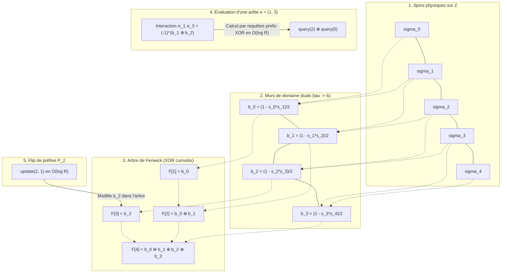

# Rapport : dynamique de Glauber géométrique sur $\mathbb{Z}$ avec arbre de Fenwick

## 1. Objectif

On considère un graphe signé pondéré dont les sommets sont des reads ordonnés le long d'un chromosome :

$$
0, 1, \dots, R-1
$$

Chaque read porte un spin caché :

$$
\sigma_i \in \lbrace -1, +1\rbrace
$$

Les poids d'arêtes encodent des contraintes ferromagnétiques ou antiferromagnétiques :
*   Si $W_{ij} > 0$, l'arête préfère $\sigma_i = \sigma_j$ ;
*   Si $W_{ij} < 0$, l'arête préfère $\sigma_i \neq \sigma_j$ ;
*   L'intensité de la contrainte est $|W_{ij}|$.

L'objectif est de construire une dynamique MCMC de type **Glauber / Heat-Bath** adaptée à la géométrie unidimensionnelle, s'appuyant sur un **arbre de Fenwick** (Binary Indexed Tree) modulo 2 pour gérer efficacement l'ensemble des arêtes (toutes considérées comme longue portée).

---

## 2. Mesure cible

On écrit l'énergie sous la forme "arêtes non satisfaites" :

$$
U(\sigma) = \sum_{\lbrace i,j\rbrace: W_{ij}>0} |W_{ij}| \mathbf{1}_{\sigma_i \neq \sigma_j} + \sum_{\lbrace i,j\rbrace: W_{ij}<0} |W_{ij}| \mathbf{1}_{\sigma_i = \sigma_j}
$$

La postérieure cible, à température inverse $\beta$, est :

$$
\pi_\beta(\sigma \mid W) \propto \exp\bigl(-\beta U(\sigma)\bigr)
$$

Le cas $\beta=1$ correspond à la postérieure bayésienne non tempérée.

---

## 3. Variation d'énergie

Soit $A$ un ensemble de sommets que l'on flippe (renversement de spins) :

$$
\sigma_i'= \begin{cases} -\sigma_i, & i \in A \\\\ \sigma_i, & i \notin A \end{cases}
$$

Seules les arêtes coupées par $A$ changent de satisfaction. On note la coupe induite par $A$ :

$$
\delta(A) = \lbrace \lbrace i,j\rbrace\in E: |\lbrace i,j\rbrace\cap A| = 1\rbrace
$$

La variation d'énergie résultant du flip est alors :

$$
\Delta U(A) = U(\sigma')-U(\sigma) = \sum_{\lbrace i,j\rbrace\in \delta(A)} W_{ij}\sigma_i\sigma_j
$$

Pour évaluer un mouvement, il suffit de sommer les contributions signées $W_{ij}\sigma_i\sigma_j$ des arêtes traversées par la coupe $\delta(A)$ induite par ce mouvement.

---

## 4. Variables duales sur $\mathbb{Z}$

La géométrie sur $\mathbb{Z}$ suggère d'introduire les variables de murs de domaine :

$$
\tau_t = \sigma_t\sigma_{t+1}, \qquad t = 0, \dots, R-2
$$

Pour $i < j$, on reconstruit l'interaction de spin par le produit cumulé :

$$
\sigma_i\sigma_j = \prod_{t=i}^{j-1}\tau_t
$$

Un flip de préfixe $P_q = \lbrace 0, 1, \dots, q\rbrace$ ne modifie qu'un seul mur dans la représentation duale :

$$
\tau_q \mapsto -\tau_q
$$

Ainsi, dans les variables duales, les mouvements de préfixe sont parfaitement locaux. Dans les variables de spins d'origine, ils correspondent à des flips macroscopiques de blocs contigus le long du chromosome, ce qui permet de corriger efficacement les erreurs de phase (*switch errors*).

---

## 5. Définition des 4 mouvements de Glauber

Pour un read $r$, on définit les 4 mouvements candidats d'inversion :
1.  $A_0 = \varnothing$ (mouvement nul, ne fait rien)
2.  $A_1 = \lbrace r\rbrace = P_{r-1} \triangle P_r$ (flip singleton)
3.  $A_2 = P_{r-1}$ (flip du préfixe s'arrêtant avant $r$)
4.  $A_3 = P_r$ (flip du préfixe incluant $r$)

Aux bords du domaine et dans l'espace quotienté par le flip global :
*   $P_{-1}$ est le mouvement nul $\varnothing$ ;
*   $P_{R-1}$ est le flip global de tous les spins, donc il est identifié au mouvement nul $\varnothing$.

Dans les variables duales, en posant $e_q$ pour le flip du mur $q$ et $e_{-1}=e_{R-1}=0$, les mouvements sont :

$$
\mathcal{M}_r = \lbrace 0, e_{r-1}, e_r, e_{r-1}+e_r\rbrace.
$$

Cet ensemble est fermé par composition XOR. Il forme donc une classe locale de heat-bath exacte.

---

## 6. Noyau de transition : heat-bath local fermé

Pour un read $r$ choisi uniformément dans $\lbrace 0, \dots, R-1\rbrace$, on évalue les variations d'énergie $\Delta U(A)$ pour les mouvements distincts $A \in \mathcal{M}_r$.

On choisit un mouvement $A \in \mathcal{M}_r$ avec la probabilité de heat-bath :

$$
p(A) = \frac{\exp(-\beta \Delta U(A))}{\sum_{B \in \mathcal{M}_r} \exp(-\beta \Delta U(B))}
$$

*Note : Le mouvement nul $A=\varnothing$ ayant une variation d'énergie nulle $\Delta U(\varnothing) = 0$, son poids de Boltzmann au dénominateur vaut toujours $\exp(-\beta \cdot 0) = 1$.*

#### Réversibilité

Pour $r$ fixé, les 4 mouvements forment une classe fermée :

$$
\mathcal{C}_r(\sigma) =
\lbrace \sigma \oplus A : A \in \mathcal{M}_r\rbrace.
$$

Si $\sigma' \in \mathcal{C}_r(\sigma)$, alors $\mathcal{C}_r(\sigma') = \mathcal{C}_r(\sigma)$. La normalisation locale est donc la même depuis tous les états de la classe :

$$
H_r(\sigma) =
\sum_{\eta \in \mathcal{C}_r(\sigma)} \exp(-\beta U(\eta)).
$$

Le noyau conditionnel :

$$
q_r(\sigma,\sigma') =
\frac{\exp(-\beta U(\sigma'))}{H_r(\sigma)}
\mathbf{1}_{\sigma' \in \mathcal{C}_r(\sigma)}
$$

vérifie directement la balance détaillée :

$$
\pi_\beta(\sigma) q_r(\sigma,\sigma')
=
\pi_\beta(\sigma') q_r(\sigma',\sigma).
$$

Le mélange uniforme sur $r$ conserve cette réversibilité. Aucun filtre Metropolis-Hastings n'est nécessaire.

---

## 7. Arbres de Fenwick pour la Longue Portée

Puisque les reads et les arêtes s'étendent sur de longues distances (long reads), nous n'utilisons aucune distinction entre arêtes courtes et longues. L'ensemble des interactions du graphe est traité sous forme de **longue portée**. Nous n'allouons pas de tableau physique pour stocker les signes d'interaction $y_e = W_e \sigma_i \sigma_j$ en mémoire. À la place, nous maintenons l'état des spins duals $\tau_t \in \lbrace -1, +1\rbrace$ de manière paresseuse et dynamique grâce à un **arbre de Fenwick** (Binary Indexed Tree) modulo 2.

### 7.1 Principe de l'arbre modulo 2

Nous convertissons les variables de mur $\tau_t \in \lbrace -1, +1\rbrace$ en bits $b_t \in \lbrace 0, 1\rbrace$ via le codage :

$$
b_t = \frac{1 - \tau_t}{2} \quad \left(b_t = 0 \iff \tau_t = +1, \quad b_t = 1 \iff \tau_t = -1\right)
$$

L'arbre de Fenwick stocke les sommes cumulées de ces bits $b_t$ modulo 2 (c'est-à-dire via l'opérateur XOR $\oplus$). Grâce à cette structure :

1.  **Requête d'arête en $\mathcal{O}(\log R)$** : Le produit de spins pour une arête longue $e=(i,j)$ avec $i < j$ est reconstruit par :
    
$$
\sigma_i \sigma_j = \prod_{t=i}^{j-1} \tau_t = (-1)^{\sum_{t=i}^{j-1} b_t \pmod 2} = (-1)^{\text{query}(j-1) \oplus \text{query}(i-1)}
$$

    Où $\text{query}(x)$ renvoie la somme XOR des bits de $0$ à $x$ dans l'arbre, avec la convention $\text{query}(-1)=0$.
2.  **Mise à jour de mur en $\mathcal{O}(\log R)$** : Un flip de préfixe $P_q$ (qui correspond géométriquement à inverser uniquement le mur $\tau_q$) nécessite uniquement de flipper le bit $b_q$ dans l'arbre via une opération `update(q, 1)`. Le flip singleton $\lbrace r\rbrace = P_{r-1} \triangle P_r$ se traduit par deux mises à jour adjacentes, `update(r-1, 1)` et `update(r, 1)`, en ignorant les murs hors domaine.

### 7.2 Schéma explicatif du calcul et de la mise à jour

Le schéma ci-dessous montre comment l'arbre de Fenwick modulo 2 maintient l'état et permet d'évaluer ou de modifier les interactions à longue portée.

```
Grille Z (Spins)          σ₀ ------- σ₁ ------- σ₂ ------- σ₃ ------- σ₄
                                 │          │          │          │
Murs de domaine (tau)          b₀=0       b₁=1       b₂=0       b₃=1   (bits modulo 2)
                                 │          │          │          │
Arbre de Fenwick           ┌─────▼─────┐    │    ┌─────▼─────┐    │
(Sommes XOR cumulées)      │ F[1] = b₀ │    │    │ F[3] = b₂ │    │
                           └─────┬─────┘    │    └─────┬─────┘    │
                                 └────►┌────▼────┐      └────►┌────▼────┐
                                       │F[2]=b₀⊕b│            │F[4]=b₀⊕b│
                                       └─────────┘            │ ₁⊕b₂⊕b₃ │
                                                              └─────────┘

--------------------------------------------------------------------------------------
REQUÊTE D'UNE ARÊTE e = (1, 3) :
Calcul de σ₁σ₃ = τ₁ * τ₂  ==>  b₁ ⊕ b₂
  - query(2) = b₀ ⊕ b₁ ⊕ b₂
  - query(0) = b₀
  - Résultat = query(2) ⊕ query(0) = b₁ ⊕ b₂
    Plus généralement, query(j-1) ⊕ query(i-1) extrait exactement les murs entre i et j en temps O(log R).

MISE À JOUR PAR UN FLIP DE PRÉFIXE P₂ :
Renversement de τ₂ (b₂ ⊕= 1)  ==>  Appel unique à update(2, 1) qui met à jour F[2] et F[4] en O(log R).
```

### 7.3 Diagramme structurel complet (Mermaid)



---

## 8. Algorithme détaillé d'un pas de transition

À chaque pas de temps $t$ :

1.  **Sélection** : Choisir un read $r$ uniformément dans $\lbrace 0, \dots, R-1\rbrace$.
2.  **Construction des candidats distincts** :
    Construire les mouvements $\varnothing$, $\lbrace r\rbrace$, $P_{r-1}$ et $P_r$, puis supprimer les doublons éventuels aux bords.
3.  **Calcul des énergies de proposition (état $\sigma$)** :
    Le mouvement nul a une énergie $\Delta U(\varnothing)=0$. Pour un préfixe valide :

$$
\Delta U(P_q) =
\sum_{e \in \text{cross}[q]} W_e \cdot
(-1)^{\text{query}(e.right-1) \oplus \text{query}(e.left-1)}.
$$

    Pour le singleton :

$$
\Delta U(\lbrace r\rbrace) =
\sum_{e=\lbrace r,j\rbrace} W_e \cdot
(-1)^{\text{query}(e.right-1) \oplus \text{query}(e.left-1)}.
$$

    De manière équivalente, $\delta(\lbrace r\rbrace)$ est la différence symétrique des deux coupes adjacentes $\text{cross}[r-1]$ et $\text{cross}[r]$ ; les arêtes qui traversent les deux coupes ne doivent pas être comptées.
4.  **Sélection du mouvement** :
    Échantillonner un candidat $A$ selon les probabilités :

$$
p(A) =
\frac{\exp(-\beta \Delta U(A))}
{\sum_{B \in \mathcal{M}_r} \exp(-\beta \Delta U(B))}.
$$

5.  **Application du mouvement** :
    Appliquer immédiatement le mouvement sélectionné dans l'arbre de Fenwick. Un préfixe $P_q$ déclenche `update(q, 1)` si $q$ est un mur valide ; le singleton $\lbrace r\rbrace$ déclenche les deux mises à jour valides `update(r-1, 1)` et `update(r, 1)`. Aucun calcul de retour n'est effectué.

---

## 9. Encodage optimal des arêtes et des listes de coupe

Pour chaque arête $e=\lbrace i,j\rbrace$, on stocke ses attributs de manière orientée :
```python
left[e]  = min(i,j)
right[e] = max(i,j)
W[e]     = W_ij
```

On pré-calcule et stocke la structure de coupe pour chaque position :

$$
\text{cross}[q] = \lbrace  e \in E : \text{left}[e] \le q < \text{right}[e] \rbrace
$$

Cette structure permet d'accéder instantanément à la liste des arêtes traversées par une coupe $q$. Pour les flips singletons, on stocke aussi :

$$
\text{incident}[r] = \lbrace e \in E : \text{left}[e] = r \text{ ou } \text{right}[e] = r \rbrace.
$$

On peut également obtenir cette liste comme différence symétrique des deux coupes adjacentes $\text{cross}[r-1]$ et $\text{cross}[r]$, en ignorant les coupes hors domaine. La complexité d'évaluation d'une coupe est de $\mathcal{O}(|\text{cross}[q]| \log R)$, et celle d'un singleton est de $\mathcal{O}(|\text{incident}[r]| \log R)$.

---

## 10. Complexité

Sous l'hypothèse d'une congestion de coupe bornée :

$$
\sup_q |\text{cross}[q]| = \mathcal{O}(1)
$$

Le coût d'évaluation des 4 mouvements candidats est en **$\mathcal{O}(\log R)$**. Ce coût logarithmique est extrêmement performant et garantit une excellente scalabilité même en présence de reads très longs couvrant de nombreuses coupes.

---

## 11. Estimation des corrélations spin-spin $k$-hop

On estime l'espérance des corrélations $C_{ij} = \mathbb{E}_{\pi_\beta}[\sigma_i\sigma_j]$ pour toutes les paires à distance de graphe au plus $k$ (ensemble $\mathcal{P}_k$).

On maintient de manière creuse (*sparse*) pour chaque paire $p=(i,j)$ :
```python
corr_value[p] = sigma_i * sigma_j
corr_sum[p]
last_time[p]
```

### Accumulation événementielle
Pour éviter de mettre à jour toutes les paires à chaque itération, on utilise une accumulation événementielle :
Lorsqu'un mouvement non nul est appliqué au pas de temps $t$ et sépare la paire $p$ (c'est-à-dire que le flip coupe l'intervalle de la paire), on met à jour sa somme cumulée :
```python
corr_sum[p] += corr_value[p] * (t - last_time[p])
corr_value[p] *= -1
last_time[p] = t
```

À la fin de l'échantillonnage (temps $T$), on effectue un flush final :
```python
corr_sum[p] += corr_value[p] * (T - last_time[p])
C[p] = corr_sum[p] / T
```

Les paires affectées par une coupe $q$ sont pré-calculées dans la liste :

$$
\mathcal{P}_{\text{cross}}(q) = \lbrace  p = (i,j) \in \mathcal{P}_k : i \le q < j \rbrace
$$

---

## 12. Plan d'implémentation

### Phase 1 : Structures de Données et Indexation
1.  Construire la liste des arêtes $E$ avec `left`, `right` et `weight`.
2.  Construire les listes de coupe `cross[q]` pour chaque mur $q \in \lbrace 0, \dots, R-2\rbrace$.
3.  Construire les listes d'incidence `incident[r]` pour l'évaluation directe des flips singletons.
4.  Initialiser l'arbre de Fenwick de taille $R-1$ avec des bits à $0$ (représentant $\tau_t = 1$ partout, soit des spins identiques $\sigma_i = \sigma_0$ pour tout $i$).

### Phase 2 : Noyau de transition Glauber fermé
1.  Coder les fonctions de requête XOR de l'arbre de Fenwick.
2.  Implémenter la routine d'évaluation d'une coupe $\Delta U(P_q)$.
3.  Implémenter l'évaluation des singletons $\Delta U(\lbrace r\rbrace)$ via `incident[r]` ou via la différence symétrique des coupes adjacentes.
4.  Implémenter la boucle de transition heat-bath (calcul des 4 candidats, sélection, application directe).

### Phase 3 : Accumulateur de corrélations
1.  Construire $\mathcal{P}_k$ par une recherche en largeur (BFS) limitée à la profondeur $k$.
2.  Indexer les paires par listes de coupe $\mathcal{P}_{\text{cross}}(q)$.
3.  Implémenter l'accumulation événementielle sur les paires impactées lors de chaque transition appliquée.

---

## 13. Conclusion

La dynamique géométrique de Glauber / Heat-Bath à 4 mouvements, couplée à un arbre de Fenwick modulo 2, fournit un cadre d'échantillonnage optimal et rigoureux pour le problème d'haplotypage.
En traitant toutes les arêtes comme des interactions à longue portée évaluées paresseusement, nous éliminons le besoin de structures physiques complexes en mémoire. Les requêtes et mises à jour s'effectuent toutes en temps logarithmique $\mathcal{O}(\log R)$. Enfin, le choix du voisinage fermé $\lbrace \varnothing, \lbrace r\rbrace, P_{r-1}, P_r\rbrace$ transforme chaque étape en véritable heat-bath local, sans correction Metropolis-Hastings.
