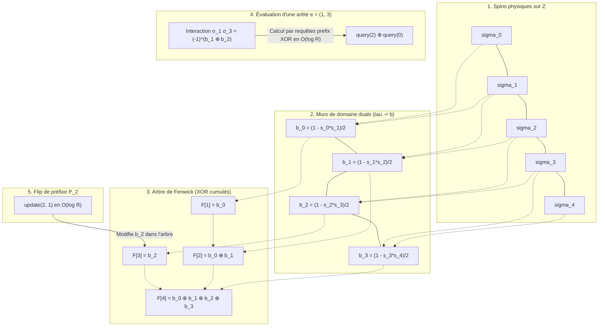

# Rapport : dynamique de Glauber géométrique sur $\mathbb{Z}$ avec arbre de Fenwick

## 1. Objectif

On considère un graphe signé pondéré dont les sommets sont des reads ordonnés le long d'un chromosome :

$$
0, 1, \dots, R-1
$$

Chaque read porte un spin caché :

$$
\sigma_i \in \lbrace -1, +1\rbrace
$$

Les poids d'arêtes encodent des contraintes ferromagnétiques ou antiferromagnétiques :
*   Si $W_{ij} > 0$, l'arête préfère $\sigma_i = \sigma_j$ ;
*   Si $W_{ij} < 0$, l'arête préfère $\sigma_i \neq \sigma_j$ ;
*   L'intensité de la contrainte est $|W_{ij}|$.

L'objectif est de construire une dynamique MCMC de type **Glauber / Heat-Bath** adaptée à la géométrie unidimensionnelle, s'appuyant sur un **arbre de Fenwick** (Binary Indexed Tree) modulo 2 pour gérer efficacement l'ensemble des arêtes (toutes considérées comme longue portée).

---

## 2. Mesure cible

On écrit l'énergie sous la forme "arêtes non satisfaites" :

$$
U(\sigma) = \sum_{\lbrace i,j\rbrace: W_{ij}>0} |W_{ij}| \mathbf{1}_{\sigma_i \neq \sigma_j} + \sum_{\lbrace i,j\rbrace: W_{ij}<0} |W_{ij}| \mathbf{1}_{\sigma_i = \sigma_j}
$$

La postérieure cible est :

$$
\mu(\sigma \mid W) \propto \exp\bigl(-U(\sigma)\bigr)
$$

---

## 3. Variation d'énergie

Soit $A$ un ensemble de sommets que l'on flippe (renversement de spins) :

$$
\sigma_i'= \begin{cases} -\sigma_i, & i\in A,\\ \sigma_i, & i\notin A \end{cases}
$$

Seules les arêtes coupées par $A$ changent de satisfaction. On note la coupe induite par $A$ :

$$
\delta(A) = \lbrace \lbrace i,j\rbrace\in E: |\lbrace i,j\rbrace\cap A| = 1\rbrace
$$

La variation d'énergie résultant du flip est alors :

$$
\Delta U(A) = U(\sigma')-U(\sigma) = \sum_{\lbrace i,j\rbrace\in \delta(A)} W_{ij}\sigma_i\sigma_j
$$

Pour évaluer un mouvement, il suffit de sommer les contributions signées $W_{ij}\sigma_i\sigma_j$ des arêtes traversées par la coupe $\delta(A)$ induite par ce mouvement.

---

## 4. Variables duales sur $\mathbb{Z}$

La géométrie sur $\mathbb{Z}$ suggère d'introduire les variables de murs de domaine :

$$
\tau_t = \sigma_t\sigma_{t+1}, \qquad t = 0, \dots, R-2
$$

Pour $i < j$, on reconstruit l'interaction de spin par le produit cumulé :

$$
\sigma_i\sigma_j = \prod_{t=i}^{j-1}\tau_t
$$

Un flip de préfixe $P_q = \lbrace 0, 1, \dots, q\rbrace$ ne modifie qu'un seul mur dans la représentation duale :

$$
\tau_q \mapsto -\tau_q
$$

Ainsi, dans les variables duales, les mouvements de préfixe sont parfaitement locaux. Dans les variables de spins d'origine, ils correspondent à des flips macroscopiques de blocs contigus le long du chromosome, ce qui permet de corriger efficacement les erreurs de phase (*switch errors*).

---

## 5. Définition des 5 mouvements de Glauber

Pour un read $r$, on définit les 5 mouvements candidats d'inversion :
1.  $A_0 = \varnothing$ (mouvement nul, ne fait rien)
2.  $A_1 = \lbrace r\rbrace$ (flip singleton)
3.  $A_2 = P_{r-1}$ (flip du préfixe s'arrêtant avant $r$)
4.  $A_3 = P_r$ (flip du préfixe incluant $r$)
5.  $A_4 = P_{r+1}$ (flip du préfixe incluant $r+1$)

Aux bords du domaine, les mouvements hors bornes sont rabattus :
*   $P_{-1}$ est le mouvement nul $\varnothing$ ;
*   $P_R$ est remplacé par $P_{R-1}$ (le flip global de tous les spins, qui a une variation d'énergie nulle).

---

## 6. Noyau de transition : Glauber avec correction de Metropolis-Hastings

Pour un read $r$ choisi uniformément dans $\lbrace 0, \dots, R-1\rbrace$, on évalue les variations d'énergie $\Delta U_m$ pour les 5 mouvements candidats $m \in \lbrace 0, \dots, 4\rbrace$.

On souhaite choisir un mouvement $m$ avec une probabilité de type Glauber / Heat-Bath :

$$
p_m = \frac{\exp(-\beta \Delta U_m)}{\sum_{k=0}^4 \exp(-\beta \Delta U_k)}
$$

*Note : Le mouvement nul $m=0$ (correspondant à $\varnothing$) ayant une variation d'énergie nulle $\Delta U_0 = 0$, son poids de Boltzmann au dénominateur vaut toujours $\exp(-\beta \cdot 0) = 1$.*

#### Non-fermeture du voisinage et correction de Metropolis-Hastings

Le jeu de mouvements $\mathcal{M} = \lbrace \varnothing, \lbrace r\rbrace, P_{r-1}, P_r, P_{r+1}\rbrace$ n'est pas fermé par composition (par exemple, la composition de $P_{r-1}$ et $P_{r+1}$ n'appartient pas à $\mathcal{M}$). Les voisinages des états de départ et d'arrivée ne sont donc pas symétriques, ce qui brise la balance détaillée si l'on applique le choix Glauber directement.

Pour restaurer rigoureusement la réversibilité de la chaîne par rapport à la distribution cible, on applique un filtre d'acceptation de Metropolis-Hastings. Si un mouvement $m > 0$ est sélectionné (menant à l'état $\sigma'$), on l'accepte avec la probabilité :

$$
\alpha(\sigma \to \sigma') = \min\left(1, \frac{\sum_{k=0}^4 \exp(-\beta \Delta U_k(\sigma))}{\sum_{k=0}^4 \exp(-\beta \Delta U_k(\sigma'))}\right)
$$

Où $\Delta U_k(\sigma')$ désigne les variations d'énergie des 5 mouvements évalués à partir du nouvel état $\sigma'$. Si le mouvement est rejeté, le système retourne à l'état $\sigma$.

---

## 7. Arbres de Fenwick pour la Longue Portée

Puisque les reads et les arêtes s'étendent sur de longues distances (long reads), nous n'utilisons aucune distinction entre arêtes courtes et longues. L'ensemble des interactions du graphe est traité sous forme de **longue portée**. Nous n'allouons pas de tableau physique pour stocker les signes d'interaction $y_e = W_e \sigma_i \sigma_j$ en mémoire. À la place, nous maintenons l'état des spins duals $\tau_t \in \lbrace -1, +1\rbrace$ de manière paresseuse et dynamique grâce à un **arbre de Fenwick** (Binary Indexed Tree) modulo 2.

### 7.1 Principe de l'arbre modulo 2

Nous convertissons les variables de mur $\tau_t \in \lbrace -1, +1\rbrace$ en bits $b_t \in \lbrace 0, 1\rbrace$ via le codage :

$$
b_t = \frac{1 - \tau_t}{2} \quad \left(b_t = 0 \iff \tau_t = +1, \quad b_t = 1 \iff \tau_t = -1\right)
$$

L'arbre de Fenwick stocke les sommes cumulées de ces bits $b_t$ modulo 2 (c'est-à-dire via l'opérateur XOR $\oplus$). Grâce à cette structure :

1.  **Requête d'arête en $\mathcal{O}(\log R)$** : Le produit de spins pour une arête longue $e=(i,j)$ avec $i < j$ est reconstruit par :
    
$$
\sigma_i \sigma_j = \prod_{t=i}^{j-1} \tau_t = (-1)^{\sum_{t=i}^{j-1} b_t \pmod 2} = (-1)^{\text{query}(j-1) \oplus \text{query}(i-1)}
$$

    Où $\text{query}(x)$ renvoie la somme XOR des bits de $0$ à $x$ dans l'arbre.
2.  **Mise à jour de mur en $\mathcal{O}(\log R)$** : Un flip de préfixe $P_q$ (qui correspond géométriquement à inverser uniquement le mur $\tau_q$) nécessite uniquement de flipper le bit $b_q$ dans l'arbre via une opération `update(q, 1)`.

### 7.2 Schéma explicatif du calcul et de la mise à jour

Le schéma ci-dessous montre comment l'arbre de Fenwick modulo 2 maintient l'état et permet d'évaluer ou de modifier les interactions à longue portée.

```
Grille Z (Spins)          σ₀ ------- σ₁ ------- σ₂ ------- σ₃ ------- σ₄
                                 │          │          │          │
Murs de domaine (tau)          b₀=0       b₁=1       b₂=0       b₃=1   (bits modulo 2)
                                 │          │          │          │
Arbre de Fenwick           ┌─────▼─────┐    │    ┌─────▼─────┐    │
(Sommes XOR cumulées)      │ F[1] = b₀ │    │    │ F[3] = b₂ │    │
                           └─────┬─────┘    │    └─────┬─────┘    │
                                 └────►┌────▼────┐      └────►┌────▼────┐
                                       │F[2]=b₀⊕b│            │F[4]=b₀⊕b│
                                       └─────────┘            │ ₁⊕b₂⊕b₃ │
                                                              └─────────┘

--------------------------------------------------------------------------------------
REQUÊTE D'UNE ARÊTE e = (1, 3) :
Calcul de σ₁σ₃ = τ₁ * τ₂  ==>  b₁ ⊕ b₂
  - query(2) = F[2] = b₀ ⊕ b₁
  - query(0) = F[0] = 0 (ou vide)
  - Résultat = query(2) ⊕ query(0) = b₀ ⊕ b₁ ⊕ 0 ⊕ b₀
    Plus précisément, query(j-1) ⊕ query(i-1) extrait exactement b₁ ⊕ b₂ en temps O(log R).

MISE À JOUR PAR UN FLIP DE PRÉFIXE P₂ :
Renversement de τ₂ (b₂ ⊕= 1)  ==>  Appel unique à update(2, 1) qui met à jour F[2] et F[4] en O(log R).
```

### 7.3 Diagramme structurel complet (Mermaid)



---

## 8. Algorithme détaillé d'un pas de transition

À chaque pas de temps $t$ :

1.  **Sélection** : Choisir un read $r$ uniformément dans $\lbrace 0, \dots, R-1\rbrace$.
2.  **Calcul des énergies de proposition (état $\sigma$)** :
    Pour chaque mouvement $m \in \lbrace 1..4\rbrace$ (qui correspond à une coupe $q_m$) :
    
$$
\Delta U_m(\sigma) = \sum_{e \in \text{cross}[q_m]} W_e \cdot (-1)^{\text{query}(e.right-1) \oplus \text{query}(e.left-1)}
$$

    Le mouvement nul $m=0$ a une énergie $\Delta U_0(\sigma) = 0$. La décomposition de singleton $\lbrace r\rbrace = P_{r-1} \triangle P_r$ est évaluée par la somme des deux coupes de préfixes correspondantes.
3.  **Sélection du mouvement** : Échantillonner $m \in \lbrace 0..4\rbrace$ selon les probabilités Glauber $p_m \propto \exp(-\beta \Delta U_m(\sigma))$.
4.  **Cas d'arrêt rapide** : Si $m = 0$ (mouvement nul), le pas s'arrête immédiatement.
5.  **Application temporaire** : Si $m > 0$, appliquer le flip (opération XOR sur l'index du mur correspondant dans l'arbre de Fenwick). L'état devient $\sigma'$.
6.  **Calcul des énergies de retour (état $\sigma'$)** :
    Évaluer les 5 variations d'énergie $\Delta U_k(\sigma')$ à partir de ce nouvel état en interrogeant à nouveau l'arbre de Fenwick.
7.  **Acceptation / Rejet** :
    Calculer la probabilité d'acceptation $\alpha$ (ratio des sommes de Boltzmann locales).
    Tirer un nombre uniforme $U \sim \text{Unif}(0,1)$.
    *   Si $U > \alpha$ : rejeter le mouvement et restaurer l'état dans l'arbre de Fenwick (ré-appliquer le XOR sur le mur).
    *   Si $U \le \alpha$ : accepter définitivement le mouvement.

---

## 9. Encodage optimal des arêtes et des listes de coupe

Pour chaque arête $e=\lbrace i,j\rbrace$, on stocke ses attributs de manière orientée :
```python
left[e]  = min(i,j)
right[e] = max(i,j)
W[e]     = W_ij
```

On pré-calcule et stocke la structure de coupe pour chaque position :

$$
\text{cross}[q] = \lbrace  e \in E : \text{left}[e] \le q < \text{right}[e] \rbrace
$$

Cette structure permet d'accéder instantanément à la liste des arêtes traversées par une coupe $q$. La complexité d'évaluation d'une coupe est de $\mathcal{O}(|\text{cross}[q]| \log R)$.

---

## 10. Complexité

Sous l'hypothèse d'une congestion de coupe bornée :

$$
\sup_q |\text{cross}[q]| = \mathcal{O}(1)
$$

Le coût d'évaluation des 5 mouvements candidats et de l'acceptation Metropolis-Hastings est en **$\mathcal{O}(\log R)$**. Ce coût logarithmique est extrêmement performant et garantit une excellente scalabilité même en présence de reads très longs couvrant de nombreuses coupes.

---

## 11. Estimation des corrélations spin-spin $k$-hop

On estime l'espérance des corrélations $C_{ij} = \mathbb{E}_{\mu}[\sigma_i\sigma_j]$ pour toutes les paires à distance de graphe au plus $k$ (ensemble $\mathcal{P}_k$).

On maintient de manière creuse (*sparse*) pour chaque paire $p=(i,j)$ :
```python
corr_value[p] = sigma_i * sigma_j
corr_sum[p]
last_time[p]
```

### Accumulation événementielle
Pour éviter de mettre à jour toutes les paires à chaque itération, on utilise une accumulation événementielle :
Lorsqu'un mouvement est accepté au pas de temps $t$ et sépare la paire $p$ (c'est-à-dire que le flip coupe l'intervalle de la paire), on met à jour sa somme cumulée :
```python
corr_sum[p] += corr_value[p] * (t - last_time[p])
corr_value[p] *= -1
last_time[p] = t
```

À la fin de l'échantillonnage (temps $T$), on effectue un flush final :
```python
corr_sum[p] += corr_value[p] * (T - last_time[p])
C[p] = corr_sum[p] / T
```

Les paires affectées par une coupe $q$ sont pré-calculées dans la liste :

$$
\mathcal{P}_{\text{cross}}(q) = \lbrace  p = (i,j) \in \mathcal{P}_k : i \le q < j \rbrace
$$

---

## 12. Plan d'implémentation

### Phase 1 : Structures de Données et Indexation
1.  Construire la liste des arêtes $E$ avec `left`, `right` et `weight`.
2.  Construire les listes de coupe `cross[q]` pour chaque mur $q \in \lbrace 0, \dots, R-2\rbrace$.
3.  Initialiser l'arbre de Fenwick de taille $R-1$ avec des bits à $0$ (représentant $\tau_t = 1$ partout, soit des spins identiques $\sigma_i = \sigma_0$ pour tout $i$).

### Phase 2 : Noyau de transition Glauber-MH
1.  Coder les fonctions de requête XOR de l'arbre de Fenwick.
2.  Implémenter la routine d'évaluation d'une coupe $\Delta U(P_q)$.
3.  Implémenter la décomposition des singletons en différence de deux coupes de préfixes.
4.  Implémenter la boucle de transition (calcul Glauber, sélection, application temporaire, calcul de retour, filtrage Metropolis-Hastings).

### Phase 3 : Accumulateur de corrélations
1.  Construire $\mathcal{P}_k$ par une recherche en largeur (BFS) limitée à la profondeur $k$.
2.  Indexer les paires par listes de coupe $\mathcal{P}_{\text{cross}}(q)$.
3.  Implémenter l'accumulation événementielle sur les paires impactées lors de chaque transition validée.

---

## 13. Conclusion

La dynamique géométrique de Glauber / Heat-Bath à 5 mouvements, couplée à un arbre de Fenwick modulo 2, fournit un cadre d'échantillonnage optimal et rigoureux pour le problème d'haplotypage. 
En traitant toutes les arêtes comme des interactions à longue portée évaluées paresseusement, nous éliminons le besoin de structures physiques complexes en mémoire. Les requêtes et mises à jour s'effectuent toutes en temps logarithmique $\mathcal{O}(\log R)$. Enfin, le filtre Metropolis-Hastings corrige exactement la non-fermeture géométrique des propositions, garantissant la convergence vers la postérieure bayésienne ciblée.
